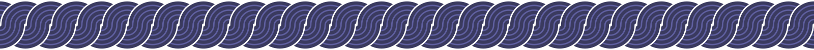

Hi I'm Henry, and I build things for the web. In my freetime I build everything from Chrome extensions to Unity games, but my professional focus is on full-stack web development. My journey into tech has been driven by curiosity and a love for creating innovative solutions.

Before I discovered a professional interest in programming, I was working in the field of clinical research. I have always loved to work with people, and with organizations that I believe are contributing to the common good. I am eager to bring my diverse skill set and enthusiasm to a purpose-driven development team.

